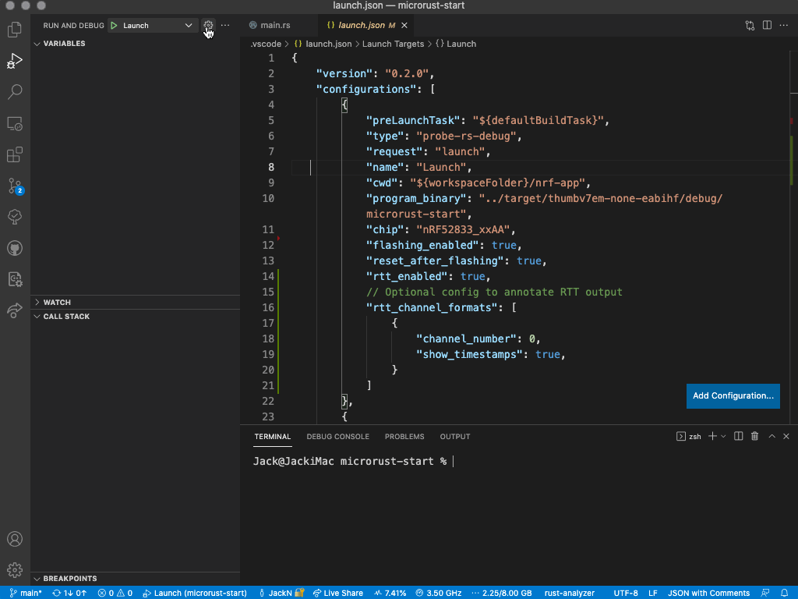

# VS Code probe-rs-debugger

## Documentation

Full documentation on Installation, Configuration and supported functionality
can be found at [the probe-rs webpage](https://probe.rs/docs/tools/vscode/) and
under the [visual tour
heading](https://probe.rs/docs/tools/vscode/#a-visual-guide-of-implemented-features)

## Development Setup

To work on this extensions, you first need to install VS Code and nodejs.
Afterwards, follow the following steps:

* Install yarn:

      npm install -g yarn

* Checkout this repository
* Inside the repository, install the prerequisites:

      yarn

* Install the extensions VS Code recommends. If you prefer to do this manually,
  you can find the list of recommended extensions in the repository's
  `.vscode/settings.json' file. These can then be installed from the command
  line, for example:

      code --install-extension amodio.tsl-problem-matcher

* Open VS Code
* Press F5 to start a new VS Code instance where the extension can be debugged.
  You can also open the "Run and Debug" panel in the left sidebar, and then
  start the "Extension" debug configuration.

### To run against a compiled executable of `probe-rs-debugger`

* Modify the `debug-example` entry in '.vscode/launch.json' file to point to
  your target project.
* Press `F5` to __build and launch executable__ `probe-rs-debugger`. VSCode will
  open another VS Code window. In that window,
  * You will see the `debug-example` project you just configured.
* Select the debug environment `probe_rs Executable Test`.* Press `F5` to start
  debugging.

### To run against a debuggable instance of `probe-rs-debugger`

* Clone the [probe-rs](https://github.com/probe-rs/probe-rs.git) repository, and
  open it in VSCode.
  * In this `probe-rs` repo, select the debug environment `DAP-Server
    probe-rs-debugger`
  * Press `F5` to start `probe-rs-debugger` as a debuggable server.
* Switch to the VSCode instance of the probe-rs `vscode` repository.
  * Modify the `debug-example` entry in '.vscode/launch.json' file to point to
    your target project.
  * Press `F5` to __build and attach to the debuggable server instance of__
    `probe-rs-debugger`. VSCode will open another VS Code window. In that
    window:
  * You will see the `debug-example` project you just configured.
  * Select the debug environment `probe_rs Server Test`.
  * Press `F5` to start debugging.

## Generating and releasing the extension

Because the extension is still regarded as being in 'Alpha' state, it is NOT
being released on the Microsoft Visual Studio Code Extension Marketplace. The
only way to get access to updated versions of the extension is to build it
yourself, or to download it from the [GitHub release page](#development-setup)
for this extension.

### Build the extension

Building the extension refers to the process that generates the installable
`.vsix` package.

* Follow the instructions to [setup your development
  environment](#development-setup).
* In a terminal window, execute the following command:

      yarn probe-rs:package

* This will generate a .vsix file in the root of the repository

### Updating the GitHub release page

* Whenever any PR has been merged, you need to create a new release and upload
  the `.vsix` in the repository's [release
  page](https://github.com/probe-rs/vscode/releases).
* This means that every PR needs to update the version number appropriately in
  the `package.json` file. Please [see the Semantic Versioning
  guidelines](https://semver.org/).
